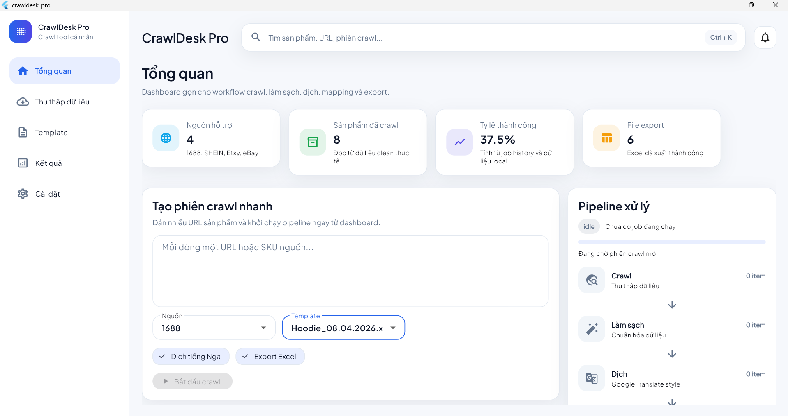
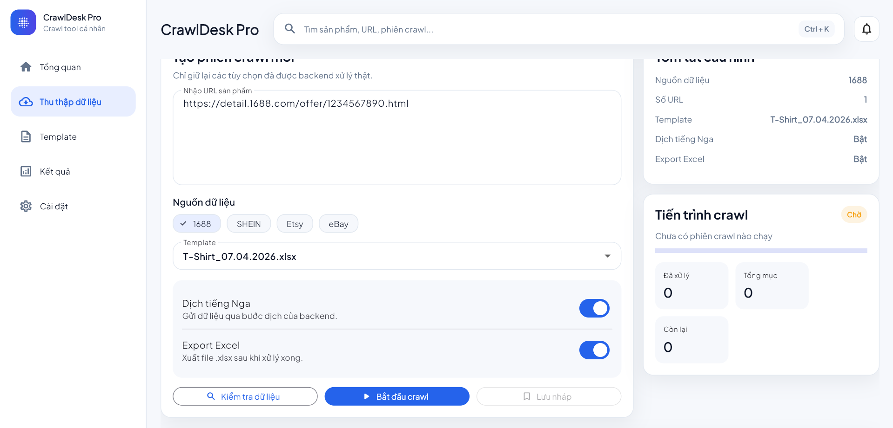
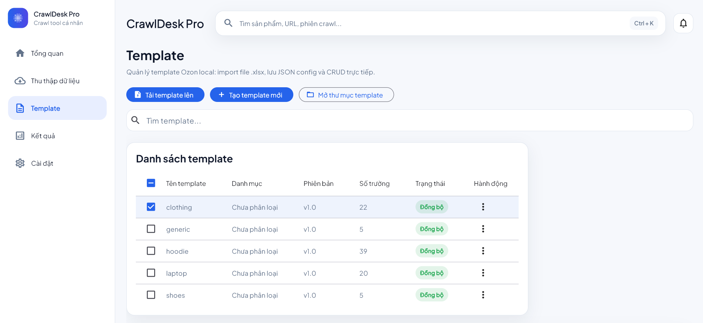
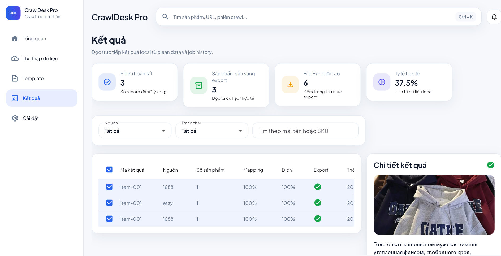
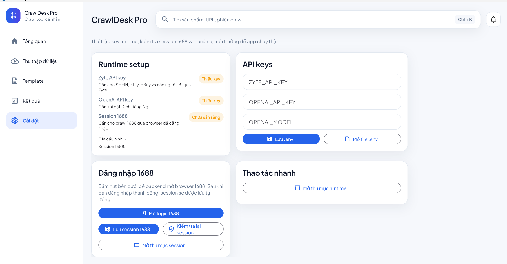

# OzonBridge - Product Crawling & Ozon Export Tool

OzonBridge is a desktop-oriented product workflow tool for collecting product data from multiple sources, cleaning and mapping it into Ozon-ready structures, translating content into Russian, generating export files, and operating the full pipeline from a Flutter desktop app.

## Highlights

- Multi-source crawling workflow for `1688`, `SHEIN`, `Etsy`, and `eBay`.
- Desktop dashboard for monitoring crawl sessions, pipeline progress, exports, and local result history.
- Local template management for Ozon categories, field mapping, and reusable export structures.
- AI-assisted Russian translation for product content inside the backend workflow.
- AI-assisted hashtag generation to enrich exported product content.
- Ozon-focused normalization and mapping pipeline before export.
- Excel export flow for processed products and mapped outputs.
- Runtime setup screen for API keys, `1688` session handling, and environment readiness checks.

## Main screens

### Dashboard Overview

The dashboard summarizes supported sources, crawl volume, success rate, export count, and gives a quick-start panel for launching a crawl directly from the home screen.

### Data Collection

The crawl screen is used to paste product URLs, choose the source marketplace, select an Ozon template, enable Russian translation, and export the processed output to Excel.

### Template Management

The template screen manages local Ozon templates, including importing `.xlsx` files, creating templates, editing metadata, and tracking sync status.

### Results

The results screen reads local processed data, shows mapping and translation completion, previews exported-ready items, and displays product detail content such as translated Russian text.

### Settings and Runtime Setup

The settings screen manages runtime configuration such as `ZYTE_API_KEY`, `OPENAI_API_KEY`, `OPENAI_MODEL`, and the `1688` session required for real crawling workflows.

## Screenshot gallery

### 1. Dashboard Overview

### 2. Data Collection

### 3. Template Management

### 4. Results Screen

### 5. Settings and Runtime Setup

## Project structure

- `1688_to_ozon/`: Python backend, crawling, normalization, translation, mapping, hashtag generation, and export logic.
- `crawldesk_pro/`: Flutter desktop frontend for dashboard, crawl control, template management, results, and settings.
- `packaging/`: Windows packaging and installer scripts.
